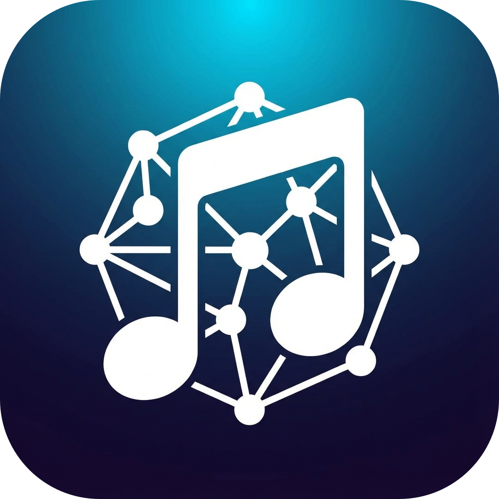

# Nexus Music Tag & Downloader

Nexus Music Tag & Downloader is a high-performance, modern desktop application designed for music enthusiasts who want complete control over their local music library. Built with a focus on speed, aesthetics, and precision, Nexus allows you to download high-quality audio from YouTube and manage your metadata with an intuitive, Mp3tag-inspired interface.



## ✨ Features

-   **High-Quality Downloads**: Powered by `yt-dlp` to fetch audio.
-   **Tag Editor**: Support for ID3, MP4, and FLAC tags with clean layout.
-   **Smart Auto-Save**: Metadata changes are saved instantly to your files as you edit.
-   **Powerful Converters**:
    -   **Tag - Filename**: Batch rename files based on metadata templates (e.g., `%artist% - %title%`).
    -   **Filename - Tag**: Extract metadata directly from filenames using customizable patterns.
-   **Cover Art Management**: Drag-and-drop support for album art.
-   **Queue Management**: Pre-edit metadata and cover art for songs before they finish downloading.

## 🚀 Getting Started

### Prerequisites
- Python 3.10+
- FFmpeg (Required for audio conversion)

### Installation
1. Clone the repository:
   ```bash
   git clone https://github.com/berriebeer/NexusMusicTagDownloader.git
   cd NexusMusicTagDownloader
   ```
2. Create and activate a virtual environment:
   ```bash
   python -m venv venv
   source venv/bin/activate  # On Windows: venv\Scripts\activate
   ```
3. Install dependencies:
   ```bash
   pip install -r requirements.txt
   ```

### Running the App
```bash
python src/main.py
```

## 🛠 Built With

This project is made possible by the incredible work of the open-source community:

-   [**PySide6**](https://www.qt.io/qt-for-python): LGPLv3 - The official Python bindings for Qt.
-   [**yt-dlp**](https://github.com/yt-dlp/yt-dlp): Unlicense - A powerful command-line audio/video downloader.
-   [**Mutagen**](https://github.com/quodlibet/mutagen): GPLv2+ - Robust Python module for handling audio metadata.
-   [**FFmpeg**](https://ffmpeg.org/): LGPL/GPL - The leading multimedia framework used for audio transcoding and processing.

## ⚖️ Licensing & Acknowledgments

This software is provided under the [MIT License](LICENSE). 

By using this application, you also interact with several third-party libraries. Please respect their respective licenses:
- **Qt/PySide6**: Uses the LGPLv3 license.
- **yt-dlp**: Released into the public domain via the Unlicense.
- **Mutagen**: Licensed under the GNU General Public License v2 or later.
- **FFmpeg**: Licensed under the LGPL 2.1 or later / GPL 2.0 or later. (Note: This app interacts with FFmpeg as an external process and does not ship with FFmpeg binaries).

---